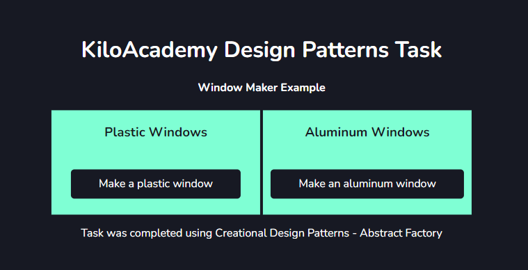
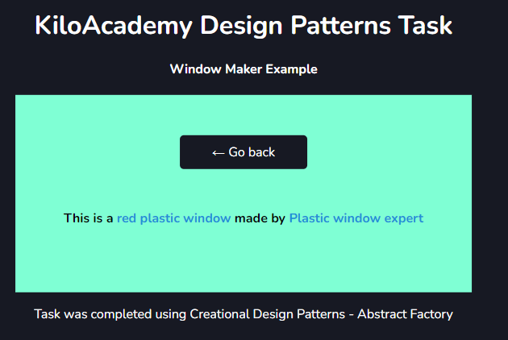

### Window Maker
The main objective of this task was to identify PHP Design Patterns that can be used to generate windows, their makers and colors. 

#### Task Notes:
To create this simple example this project used Abstract Factory from identified Creational Design Patterns.

### Install

1. Clone / Download Repository - ``https://github.com/vrbin90s/KA-T4-WindowMaker``
2. In your terminal run composer install command : ``composer install``
3. Rename .env.example file to .env or cpy example content to your empty .env file.
4. Generate your new application encryption key using artisan command : ``php artisan key:generate``
5. Run project with artisan command ``php artisan run serve``

### Usage Example

>Select what window u want to make (figure 1):

Figure 1 - Main View

>Generating example results based on the code logic (figure 2)
 

Figure 2 - Result View
